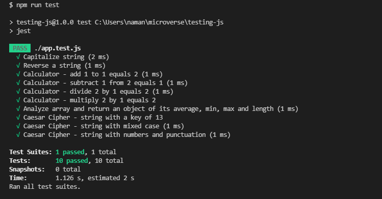

# Testing with Jest

> A list of functions in Javascript to demonstrate testing with Jest.

## Built With

- JavaScript
- HTML
- CSS

## Libraries and packages

- NPM
- Jest

### How to run

- Download and install [Node.js](https://nodejs.org/en/download/)
- Clone this repository on your terminal by running `git clone https://github.com/paulo-techie/testing-js.git`
- Change your current working directory to the project directory `cd testing-js`
- Run `npm install`
- Run `npm install --save-dev jest`
- Run `npm run test`
- Enjoy

## Contributor

👤 Paul Omondi

- Github: [@paulo-techie](https://github.com/paulo-techie)

## 🤝 Contributing

Contributions, issues and feature requests are welcome!

Feel free to check the [issues page](../../issues/).

## Show your support

Give a ⭐️ if you like this project!

## Acknowledgments

- Hat tip to anyone whose code was used
- Inspiration
- etc

## 📝 License

This project is  [MIT](./MIT.md) licensed.
